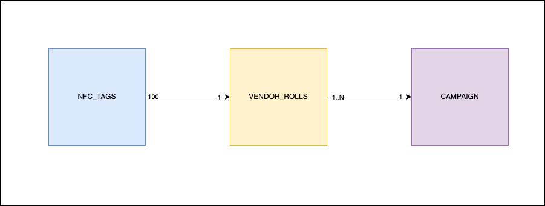
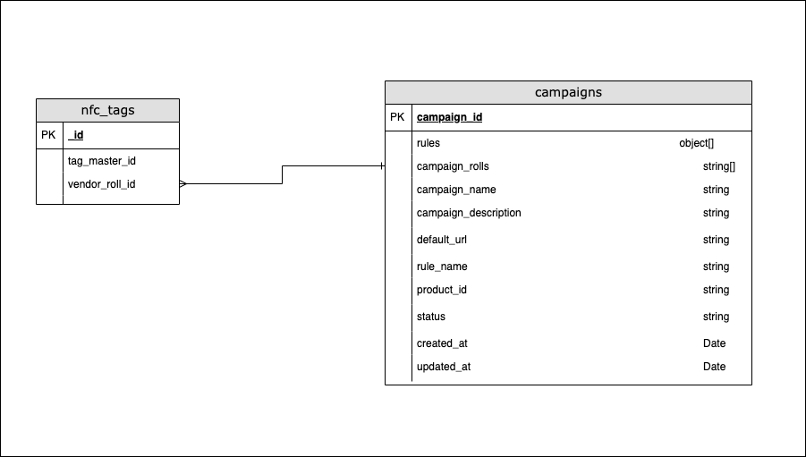

<h1>Phygiworld</h1>

  Phygiworld is a startup that aims to transform NFC tags into smart tags. 
  With Phygiworld, instead of simply opening a static URL, the NFC tags
  dynamically loads a dynamic URL based on the campaign rules saved in the
  database.

  Phygiworld users (brands) apply the NFC tags to their physical products, and
  then use the cloud platform to configure the campaign rules of those tags.

  Each NFC tag has a unique ID that is made of 8 alpha-numeric characters. 
  Each tag belongs to a roll (rolls typically have 100 tags in each). 
  Each campaign have 1 or more rolls of tags.

The entity relationships is as follows.

  

  As a developer of Phygiworld you are tasked to implement the core middleware
  function that runs when a user taps on a tag. 
  This function receives the tag ID as an input and should return the URL that
  needs to be opened based on what is saved in the campaign rules. 
  If multiple URLs are configured in the campaign rules, just return the first
  one.

  The rest of the team has already implemented the database functions that you
  can use to query the tags, rolls and campaigns data from the database. 
  To know how the data is structured in the database, you can look at the
  diagram below or simply open the JSON files inside the db directory.

  

  Please edit the main.js file and implement the <b>getTagURL</b> function.

You can run the script using
<pre>node main.js</pre>

 
There are automated tests at the end of the file, which throw an error if the
functional requirements are not satisfied.
