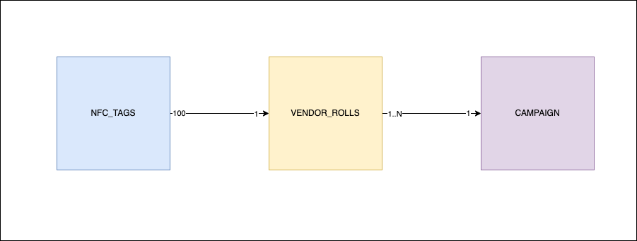
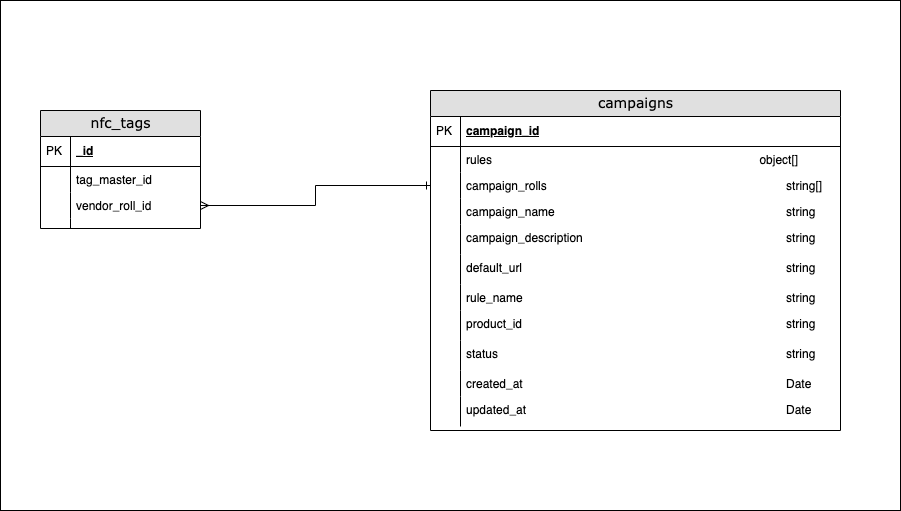

Phygiworld is a startup that aims to transform NFC tags into smart tags.<br />
With Phygiworld, instead of simply opening a static URL, the NFC tags dynamically loads a dynamic URL based on the campaign rules saved in the database.<br />
Phygiworld users (brands) apply the NFC tags to their physical products, and then use the cloud platform to configure the campaign rules of those tags.<br />
<br /><br />
Each NFC tag has a unique ID that is made of 8 alpha-numeric characters.<br />
Each tag belongs to a roll (rolls typically have 100 tags in each).<br />
Each campaign have 1 or more rolls of tags.<br />
<br /><br />
The entity relationships is as follows.



---

As a developer of Phygiworld you are tasked to implement the core middleware function that runs when a user taps on a tag.<br />
This function receives the tag ID as an input and should return the URL that needs to be opened based on what is saved in the campaign rules.<br />
The URLs are saved in the pwa_rules property in the campaigns. If multiple URLs are configured, just return the first one.<br />
<br /><br />
The rest of the team has already implemented the database functions that you can use to query the tags, rolls and campaigns data from the database.<br />
You can look at the database diagram in below or simply open the JSON files inside the db directory.<br />



---

Please edit the main.js file and implement the getTagURL function.
<br /><br />
You can run the script using

```
node main.js
```

<br />
There are automated tests at the end of the file, which throw an error if the functional requirements are not satisfied.
